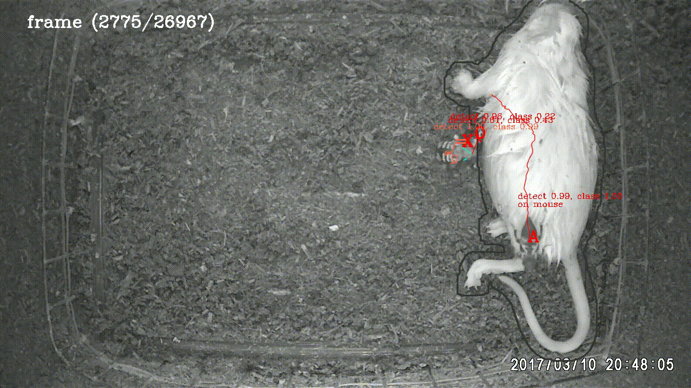

# beetle-tracking
Using Tracking-by-Detection and Multi-classification to track and identify each beetle path



## Installing

Clone the project and run the setup script to check the package dependency. Shell script will download the site-project [TensorBox](https://github.com/afunTW/TensorBox) and [keras-transfer-workflow](https://github.com/afunTW/keras-transfer-workflow).

- TensorBox, the fork from [Russell91](https://github.com/Russell91/TensorBox) with some modification
- keras-transfer-workflow, multiclass-classification the result from TensorBox

```
$ git clone https://github.com/afunTW/keras-transfer-workflow
$ ./setup.bash
```

Moreover, you can execute the download script to get the pre-trained models from [TensorBox](https://github.com/Russell91/TensorBox) and [keras-transfer-workflow](https://github.com/afunTW/keras-transfer-workflow) for beetle project.

```
$ ./download_data.bash
```

## Running

If you are going to apply a new dataset, please refer to the related repository. The following instruction only writes up the process of inference model by given video and pre-trained model where you can download by `download_data.bash`

### Step 1: Inference Detection Model

Enter the detection repo and activate the virtualenv. Execute the `generate_bbox.py` to get the detection result, it will be generate at the same place by given video with suffix `_detection`

```
# make sure to run the script under beetle-tracking/detection virtualenv
$ python generate_bbox.py \
--gpu 0 \
--weights ../models/detection/lstm_resnet_beetle_rezoom/save.ckpt-1300000 \
--video-root ../data/demo/ \
--video-type avi
```
```
.
...
├── data
│   ├── demo (given video root)
│   │   ├── demo.avi
│   │   └── demo_detection.txt (generated by detection model)
├── detection
│   ├── ...
...
```

### Step 2: Inference Multiclass-Classification Model

It's available to pass multiple models in `--models` parameter, but I use the pre-trained ResNet model only in this demonstration. This step will generate the classification result at the same place with given detection text file with suffix `_ensemble`

```
# make sure to run the script under beetle-tracking virtualenv
$ python3 ensemble_predicts.py \
--gpus 0 \
--video data/demo/demo.avi \
--detection-result data/demo/demo_detection.txt \
--models models/classification/resnet.h5
```
```
.
...
├── data
│   ├── demo
│   │   ├── demo.avi (given video)
│   │   ├── demo_detection.txt
│   │   └── demo_ensemble.txt (generated by classification model)
├── detection
│   ├── ...
...
```

### Step 3: Apply Tracking Algorithm

With that information we got in the above instruction, `main.py` in this repo apply the Hungarian matching algorithm and some constraint for this specific experiment to get the tracking path. At the end, the final output will place at `beetle-tracking/output/path/*.csv`, and you might get the extra video at `beetle-tracking/output/video/*.avi` if you pass the `--output-video` parameter.

```
# make sure to run the script under beetle-tracking virtualenv
$ python3 main.py \
--video data/demo/demo.avi \
--classification-result data/demo/demo_ensemble.txt \
--config config/default.json \
--output-video tracking_result.avi
```
```
.
...
├── data
│   ├── demo
│   │   ├── demo.avi (given video)
│   │   ├── demo_detection.txt
│   │   └── demo_ensemble.txt (generated by classification model)
├── detection
│   ├── ...
...
├── output
│   ├── path
│   │   ├── A_result.csv (generate by tracking algorithm)
│   │   ├── O_result.csv (generate by tracking algorithm)
│   │   ├── =_result.csv (generate by tracking algorithm)
│   │   └── X_result.csv (generate by tracking algorithm)
│   └── video
│       └── tracking_result.avi (optional)
...
```

## TODO

- [ ] `TensorBox` write up and confirm the stable version  
- [ ] `ensemble_predicts.py` available parellel predict (multi-GPU multi-models)
- [ ] demo script
- [ ] available to ouput the csv only

## Reference

- [End-to-end people detection in crowded scenes](https://arxiv.org/abs/1506.04878)
- [TensorBox](https://github.com/afunTW/TensorBox)